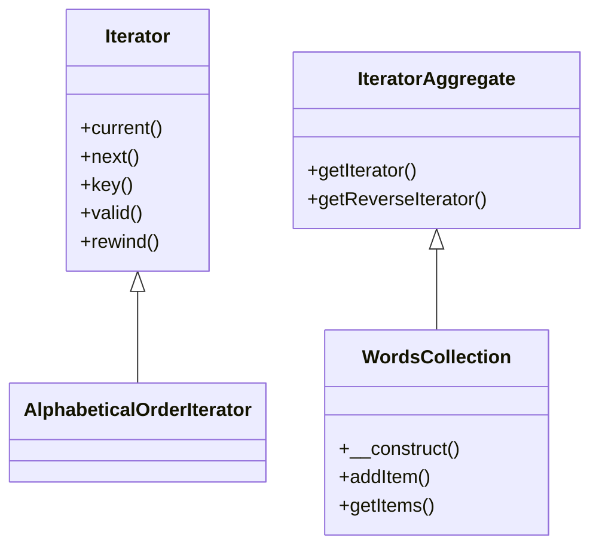

# Iterator
[Refactoring Guru - Iterator](https://refactoring.guru/design-patterns/iterator)

## Définition

Ici, l’objectif est de pouvoir parcourir une liste d’objets d’une manière algorithmique implémentée manuellement.
Aujourd’hui ça semble inutile comme pattern, car on a des structures qui utilise ce pattern pour nous. (ArrayList, List, Map, etc…) Tout ce qui est IEnumerable, en gros (IEnumerable c’est notre Iterator) avec les petites surcouches en LinQ qui vont bien…
Mais ça peut arriver que ceci ne soit pas disponible.

## Problématique
Gestion d’un ensemble d’objet sans avoir accès à des types qui permettent d’itérer sur la liste.

## Avantages

- Permet de gérer des listes de manière simple et implicite pour la personne qui va utiliser votre code.
 
- A savoir que vous n’aurez pas forcément toujours la possibilité d’utiliser un type qui gère les itérations pour vous
 
- On n’est pas obligé de s’arrêter à quelques opérations, on peut en implémenter autant qu’on le souhaite pour parcourir la liste. 

## Exercice

Exercice (Réaliser un pattern Iterator)

Réaliser un pattern Iterator, ici l'objectif est de mettre en place un iterateur pour lister une collection d'items (`WordsCollection implements \IteratorAggregate`) en `AlphabeticalOrderIterator` (`implements \Iterator`) permettant de lister les items de collection.
A noter que PHP met déjà en place pour vous les interface `Iterator` & `IteratorAggregate`.
Vous devez donc :

- Avoir une collection d'items, un bool reverse et une position pour la classe AlphabeticalOrder et y implémenter les méthodes de `IteratorAggregate`.
- La classe WordCollection doit avoir un tableau d'items et proposer les méthodes pour ajouter des items, récupérer la liste des items et une méthode `getIterator()` ainsi qu'une méthode `getReverseIterator()`.
 
Réalisez le diagramme UML + le code d'implémentation

Diagramme UML

