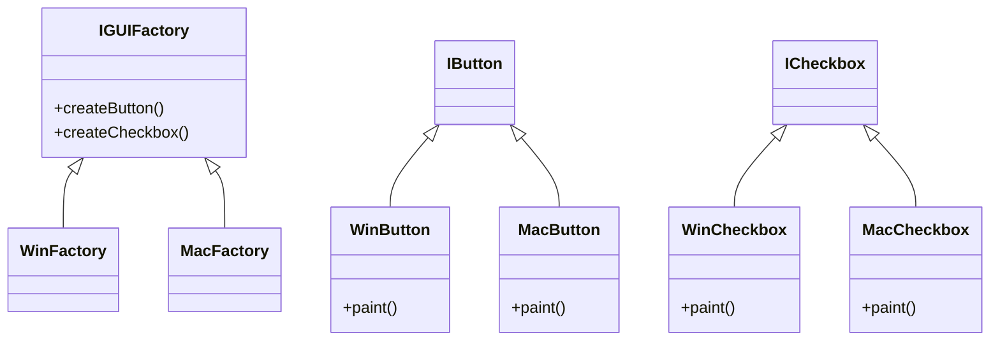

# Abstract Factory
[Refactoring Guru - Abstract Facyory](https://refactoring.guru/design-patterns/abstract-factory)

## Définition

Le pattern Abstract Factory a le même objectif que le Factory Method. Mais il permet de pouvoir gérer des objets interdépendants en s'assurant d'une compatibilité entre eux.
 
L'objectif est de créer un ensemble d'objets qui ont pour objectif d'être utilisés ensemble.

##Problématique

Comment ajouter la possibilité de gérer des objets interdépendants au Factory Method ?

## Avantages

- Instanciation dynamique des objets en gérant leur interdépendance
 
- Découplage des classes
 
- Gestion externe de l’instanciation de nos objets, on peut leur faire suivre une logique particulière (toujours dynamiquement)
 
- S'assurer de l'interopérabilité des classes

## Exercice
Exercice (Réaliser un pattern Abstract Factory)

Le but de l'exercice est d'implémenter une Abstract Factory pour gérer une interface graphique utilisateur qui peut produire différent styles de boutons et de checkboxes (Windows / MacOS)

- **Produits Abstraits** : Définir des interfaces ou des classes abstraites pour les  produits : Button et Checkbox.
- **Produits Concrets** : Créer des implémentations concrètes pour les boutons et les cases à cocher de style Windows et MacOS.
- **Fabrique Abstraite** : Définir une interface de fabrique abstraite qui déclare des méthodes pour créer des produits abstraits (Button et Checkbox).
- **Fabriques Concrètes** : Implémenter l'interface de fabrique abstraite pour les styles Windows et MacOS.
 
Réalisez le diagramme UML + le code d'implémentation

Diagramme UML

