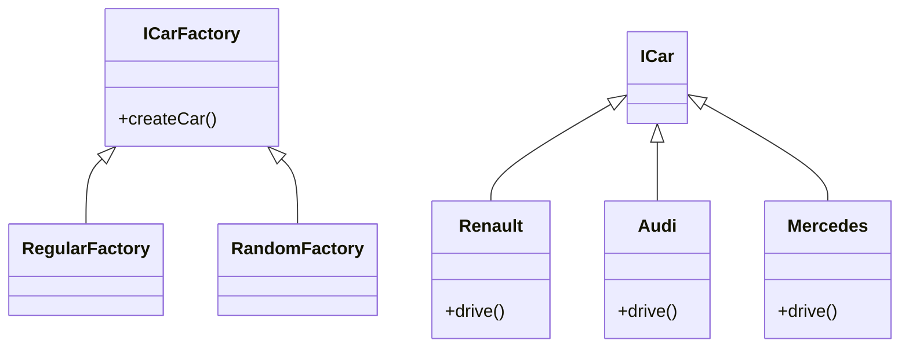

# Factory
[Refactoring Guru - Factory](https://refactoring.guru/design-patterns/factory-method)

## Définition

Le pattern factory a pour objectif de gérer la construction d’objet différemment qu’avec un « new ».

C’est la factory qui s’assure de la création / suppression de ces objets.

En général, une factory est utilisée lorsque l’on souhaite gérer la façon dont sont créer les objets via des méthodes (Par exemple, RandomCarFactory et RegularCarFactory)

## Problématique
On veut parfois ne pas avoir à gérer via le client quel type d’objet sera créer. Ou alors, on souhaite gérer un ordre de création d’objet ou pouvoir le modifier à la volée (par exemple createMutableObject ou createImmutableObject)

## Avantages

- Instanciation dynamique des objets
 
- Découplage des classes
 
- Gestion externe de l’instanciation de nos objets, on peut lui faire suivre une logique particulière (toujours dynamiquement)

## Exercice

Exercice (Réaliser un pattern Factory simple)

Réaliser un pattern Factory afin de pouvoir gérer la création de véhicules différemment à la volée dans le code. Vous allez implémenter :

- Une interface ICarFactory (qui peut être vide pour l'exo)
- Une interface ICar (qui peut aussi être vide)
- Une classe par marque de véhicule Renault, Audi, Mercedes,...
- Une classe par type d'instanciation de classe : RegularFactory & RandomFactory
- Dans un cas, la classe génère toujours les mêmes voitures, dans l'autre la classe génère des voitures de manière aléatoire.

**A noter** : Il n'est pas nécessaire de développer un vrai random pour cet exercice (mais ça rajoute un peu de code alors pourquoi pas !)

> **Optionnel** : Faites une classe qui génère des voitures suivant la suite de Fibonacci. Donc, 1 Renault, 1 Audi, 2 Mercedes, 3 Renault, 5 Audi, 8 Mercedes, 13 Renault,...

Réalisez le diagramme UML + le code d'implémentation

Diagramme UML

