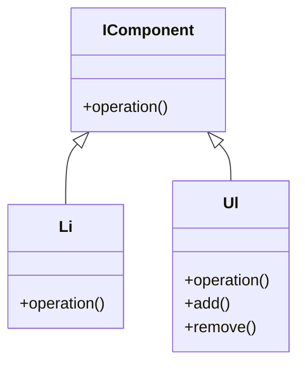

# Composite
[Refactoring Guru - Composite](https://refactoring.guru/design-patterns/composite)

## Définition

Ce pattern propose une manière de gérer la composition d’objets qui contiennent des objets en arbre.

C’est-à-dire qu’un objet est composé d’un autre objet, qui peut être composé de plusieurs autres objets, etc…

On souhaite pouvoir utiliser les mêmes méthodes que l’on soit dans un nœud composite ou dans un nœud composant.

## Problématique

Comment gérer de la récursivité de manière transparente pour le code utilisateur entre objet, sans utiliser de conditionnel sur le type de l’objet ?

## Avantages

- Meilleure lisibilité du code. (Pas de duplication, pas de gros pavés de méthodes dans une seule classe)
 
- S’assurer que chaque élément à sa propre responsabilité (découplage fort)
 
- Et surtout avoir des algorithmes interchangeables au runtime sans avoir à multiplier les classes,
 
- Gérer la récursivité facilement.

## Exercice

Exercice (Réaliser un pattern Composite)

Réaliser un pattern composite, l'idée est de pouvoir construire une arborescence de `<ul>` et de `<li>` imbriqués grâce au pattern composite. Il vous faut :

- Une interface commune (avec une méthode, par exemple : operation())
- Une classe pour le `<li>` (enfant) : Celle-ci contient une propriété en string qu'elle set depuis le constructeur. Ainsi qu'une méthode operation() retournant cette propriété.
- Une classe pour le `<ul>` (parent) : Celle-ci contient la propriété listant les classes `<li>`, ces sous éléments peuvent êtres setté depuis le constructeur & par des méthodes d'ajout et de suppression d'élément. Ici la méthode operation() va parcourir la liste des sous éléments pour réaliser l'affichage des `<ul>` / `<li>`

Réalisez le diagramme UML + le code d'implémentation

Diagramme UML

