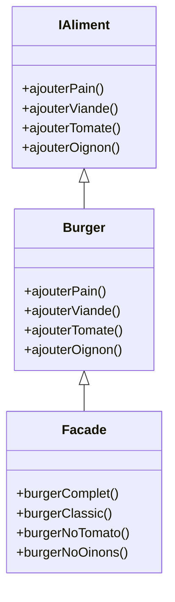

# Facade 
[Refactoring Guru - Facade](https://refactoring.guru/design-patterns/facade)

## Définition
Le pattern façade permet de gérer les multiples dépendances de manière regroupée dans une classe façade qui va nous permettre de définir un certain nombre de dépendances / instanciations à notre place.

Il peut également être utilisé comme gestionnaire de méthodes !

## Problématique
Dans nos codes, les références à d’autres objets sont multiples et fréquentes. Parfois, il devient difficile ou pénible de devoir instancier les 10 objets dont dépendent l’objet que l’on souhaite.

## Avantages

- Avantages du pattern :
    - Isoler les dépendances des sous systèmes
    - Packaging depuis une classe, c’est intéressant nan ?
- Attention par contre:
    - Un des principes peut très facilement être oublié lorsque l’on fait une façade : le principe qui dit qu’on doit connaître que ses voisins les plus proches.
    - Faites attention aux dépendances croisées et faites attention de ne pas multiplier les dépendances dans votre façade.
    - En gros : 
        - A connait B, B connait C, mais A ne DOIT PAS connaître C.
        

## Exercice

Exercice (Réaliser un pattern Façade)

Réaliser un pattern façade, l'idée est de mettre en place une façade qui va gérer pour nous l'instanciation de sous classes.

- Une classe Facade qui va gérer l'ajout d'aliments nécessaires à la réalisation d'un Burger (une simple méthode suffit, ajouterPain, ajouterViande, ajouterTomate, ajouterOignon) en utilisant une classe de gestion du Burger

- On souhaite concrètement avoir une interface avec toutes les méthode d'ajouts d'aliments et une classe Burger qui implémente ces méthodes (de simple echo suffisent)

- Et il faut que notre Facade puisse gérer la réalisation de différents burgers, comme un burgerComplet, burgerClassic, burgerNoTomato, burgerNoOinons

Réalisez le diagramme UML + le code d'implémentation

Diagramme UML

